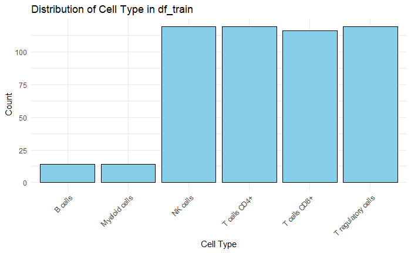
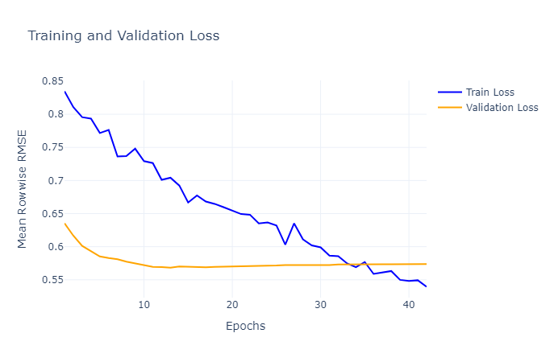

# HackOS4-2025 Single Cell Perturbation Challenge

## Overview 
Welcome to my submission for HackOS 4, organized by McGill University and University of Waterloo in collaboration with Perplexity, Rootly.ai, and SlashML (March 24 - April 2, 2025). This repository contains various model architectures with their preprocessing, training, evaluation processes, and performance visualizations.

The submission notebook showcases the architecture with the best validation loss, while the provided dataset.ipynb helps in exploring and understanding the data.

This challenge is based on the [NeurIPS 2023 Competition](https://www.kaggle.com/competitions/open-problems-single-cell-perturbations/overview).

## Dataset
The datasets are located in the "dataset/" directory. The goal is to predict how small molecules affect RNA gene sequences in specific cell types.

Key dataset statistics:
- Training set: 500 samples
- Test set: 114 samples
- Gene sequence representation: 18,211 relative numbers
- Unique small molecules in training: 119
- Unique cell types in training: 6
- Unique small molecules in testing: 28
- Common small molecules between sets: 1
- Common cell types between sets: 6 (all cell types appear in both sets)

For further dataset exploration, see the viz.Rmd file.

## Evaluation
The challenge used Mean Rowwise Root Mean Square Error (MRRMSE) on the testset as the evaluation metric. This measures how accurately the model predicts gene expression changes across all genes in each sample.

## Pre-Processing Pipeline
All model notebooks share the same pre-processing approach:

1. **Normalization and Dimensionality Reduction**: 
    - Gene sequence perturbations are normalized to 0-1 range
    - Reduced from 18,211 to 100 or 5 features using truncated SVD (5 had the best Mean Rowwise RMSE validation score)
    - This reduction enables smaller architectures suitable for the limited dataset size

2. **Data Augmentation**:
    - Custom PyTorch Dataset with 80% chance to reorder SMILES atoms using rdkit.Chem method
    - Improves model generalization through varied SMILES representations

3. **Model Embeddings**:
    - Leverages pre-trained [ChemBERTa](https://huggingface.co/seyonec/ChemBERTa-zinc-base-v1) embeddings from HuggingFace
    - These embeddings provide rich understanding of SMILES molecules
    - The embedded SMILES are concatenated with one-hot encoded cell type vectors

## CustomTransformer (Best Model Architecture)

My winning solution uses a custom transformer architecture with four key components:

### 1. Embedding Layer (see previous section)

### 2. 1D Convolutional Network
- Kernel size: 9 with padding: 4
- Applies ReLU activation and batch normalization
- Heavy dropout (0.8) for robust generalization

### 3. Transformer Encoder
- 8 attention heads capture complex molecular interactions
- Dropout (0.8) prevents overfitting on limited training data
- Effectively models relationships between molecular features

### 4. Linear Prediction Head
- Layer normalization for training stability
- Two linear layers with sigmoid activation between them
- Final layer outputs gene expression change predictions

This architecture balances representation power with regularization techniques, enabling strong performance despite the small dataset and novel molecules in the test set.

## Results
The CustomTransformer model (my best architecture) achieved:
- Validation MRRMSE: 0.5685 (at Epoch 13)
- Competition ranking: 🥇 1st place!

This score is particularly impressive considering:
- Almost no overlap of molecules between training and test sets (only 1 shared SMILES)
- Very limited training data (only 500 samples)

The low MRRMSE score indicates strong predictive accuracy, demonstrating that my model effectively generalized to novel molecular structures despite the challenging conditions.

Training progress can be visualized in the chart below:

## Discussion
The secret sauce behind this winning solution came down to three key innovations:

1. **Power of Pre-trained Chemistry Knowledge** 🧪  
   Using ChemBERTa's pre-trained embeddings gave my model a massive head start. Instead of learning molecular chemistry from scratch with limited data, the model leveraged existing chemical knowledge, allowing it to understand new molecules better than competitors.

2. **Smart Data Augmentation** 📊  
   By implementing SMILES reordering through rdkit.Chem, I effectively multiplied my training data. This technique generates chemically equivalent but structurally different representations of the same molecules, teaching the model to focus on chemical properties rather than exact string patterns.

3. **Dimensional Mastery** 📉  
   The boldest move was reducing the output dimension from 18,211 to just 5 features using Truncated SVD. This dramatic simplification allowed for a leaner model with fewer parameters to tune, making it significantly easier to train effectively on the small dataset while reducing overfitting risk.

Together, these innovations enabled a model that could generalize remarkably well to completely new molecules—the ultimate test of any chemical prediction system.